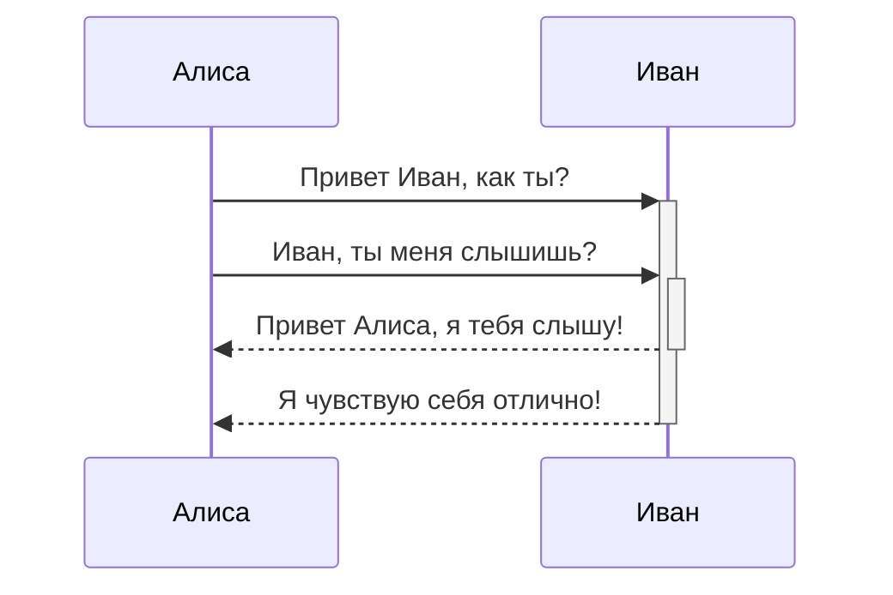
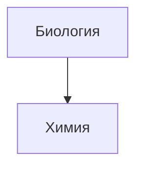

---
tags:
  - obsidian_заметки
  - public
---
[[Obsidian+Quartz]] Разворачиваем Obsidian в web на своём debian сервере
[Obsidian Web Clipper](https://chromewebstore.google.com/detail/obsidian-web-clipper/cnjifjpddelmedmihgijeibhnjfabmlf?hl=ru) Расширение для браузера для копирования статей с интернета в Obsidian
[Obsidian+Github вместо Notion: синхронизация, бекап и версионность (3-в-1) / Хабр](https://habr.com/ru/articles/843288/)


**Быстрые клавиши**
Ctrl+D - Открыть панель с Emoji

**Заметки**
Для поиска js коды для плагина [DataView](https://github.com/blacksmithgu/obsidian-dataview) ищем `123` в группе telegram [PRO Obsidian](https://t.me/obsidianrus)
[[блог на Quartz 4.0]]
## Скрыть текст под спойлер
```
<details> <summary>Тест_до_открытия</summary> Вставляем свой текст </details>
```
<details> <summary>Тест_до_открытия</summary> Вставляем свой текст </details>


## Выделение 

```md
*Этот текст будет выделен курсивом*
_Этот текст тоже будет выделен курсивом_
```

_Этот текст отобразится курсивом_
_Этот текст отобразится курсивом_

```md
**Этот текст будет выделен жирным шрифтом**
__Этот текст тоже будет выделен жирным шрифтом__
```

**Этот текст будет выделен жирным шрифтом**  
**Этот текст тоже будет выделен жирным шрифтом**

```md
_Их **можно** комбинировать_
```

_Их **можно** комбинировать_

---

## Списки 

```md
- Предмет 1
- Предмет 2
  - Предмет 2a
  - Предмет 2b

1. Предмет 1
2. Предмет 2
3. Предмет 3
   4. Предмет 3a
   5. Предмет 3b
```

- Предмет 1
- Предмет 2
    - Предмет 2a
    - Предмет 2b

1. Предмет 1
2. Предмет 2
3. Предмет 3
    1. Предмет 3a
    2. Предмет 3b

---

## Изображения 

```md

```


**Изменение размера изображений**
Пример уменьшения размера верхнего изображения до 100 пикселей в ширину:
```md

```


---
## Ссылки 

#### Внешние ссылки 

Ссылки в формате Markdown можно использовать как для отсылки к внешним объектам вроде веб-страниц, так и к внутренним страницам или изображениям.

```md
http://obsidian.md — создаются автоматически!
[Obsidian](http://obsidian.md)
```

[http://obsidian.md](http://obsidian.md/) — создаются автоматически!  
[Obsidian](http://obsidian.md/)

#### Ссылки Obsidian URI 

Ссылки [Obsidian URI](https://publish.obsidian.md/help-ru/%D0%9F%D1%80%D0%BE%D0%B4%D0%B2%D0%B8%D0%BD%D1%83%D1%82%D0%BE%D0%B5+%D0%B8%D1%81%D0%BF%D0%BE%D0%BB%D1%8C%D0%B7%D0%BE%D0%B2%D0%B0%D0%BD%D0%B8%D0%B5/%D0%98%D1%81%D0%BF%D0%BE%D0%BB%D1%8C%D0%B7%D0%BE%D0%B2%D0%B0%D0%BD%D0%B8%D0%B5+Obsidian+URI) могут использоваться для открытия заметок из текущего хранилища, из другого хранилища или других программ.

Например, вы можете вставить ссылку на файл в хранилище следующим образом (обратите внимание на [обязательную кодировку](https://publish.obsidian.md/help-ru/%D0%9F%D1%80%D0%BE%D0%B4%D0%B2%D0%B8%D0%BD%D1%83%D1%82%D0%BE%D0%B5+%D0%B8%D1%81%D0%BF%D0%BE%D0%BB%D1%8C%D0%B7%D0%BE%D0%B2%D0%B0%D0%BD%D0%B8%D0%B5/%D0%98%D1%81%D0%BF%D0%BE%D0%BB%D1%8C%D0%B7%D0%BE%D0%B2%D0%B0%D0%BD%D0%B8%D0%B5+Obsidian+URI#%D0%9A%D0%BE%D0%B4%D0%B8%D1%80%D0%BE%D0%B2%D0%BA%D0%B0)):

```md
[Ссылка на файл](obsidian://open?path=D:%2Fpath%2Fto%2Ffile.md)
```

[Ссылка на файл](obsidian://open?path=D:%2Fpath%2Fto%2Ffile.md)

Вы так же можете вставить ссылку на файл указав имя хранилища и имя файла, без полного пути до него:

```md
[Ссылка на файл](obsidian://open?vault=MainVault&file=MyNote.md)
```
[Ссылка на файл](obsidian://open?vault=MainVault&file=MyNote.md)
#### Экранирование 

Если в ссылке есть пробелы, они могут быть экранированы. Например, с использованием кода `%20` вместо пробелов:

```md
[Импорт данных](Импорт%20данных)
```
[Импорт данных](Импорт%20данных)

Или вы можете заключить цель в угловые скобки `<>`:

```md
[Демонстрация слайдов](<Демонстрация слайдов>)
```

[Демонстрация слайдов](https://publish.obsidian.md/help-ru/%D0%92%D0%BB%D0%BE%D0%B6%D0%B5%D0%BD%D0%B8%D1%8F/%D0%94%D0%B5%D0%BC%D0%BE%D0%BD%D1%81%D1%82%D1%80%D0%B0%D1%86%D0%B8%D1%8F+%D1%81%D0%BB%D0%B0%D0%B9%D0%B4%D0%BE%D0%B2)

---

## Цитирование 

```md
> Люди сталкиваются со всё более сложными и неотложными проблемами, и их эффективность в решении этих проблем имеет решающее значение для стабильности и дальнейшего прогресса общества.

\- Дуглас Энгельбарт, 1961
```

> Люди сталкиваются со всё более сложными и неотложными проблемами, и их эффективность в решении этих проблем имеет решающее значение для стабильности и дальнейшего прогресса общества.

- Дуглас Энгельбарт, 1961

---

## Встроенный код 

```md
Текст внутри `обратных кавычек` в строке будет отображаться как код. 
```

Текст внутри `обратных кавычек` в строке будет отображаться как код.

---

## Блоки кода 

Подсветка синтаксиса кода поддерживается путем указания языка после первых трех обратных кавычек. Для подсветки мы используем библиотеку PrismJS, список поддерживаемых языков можно найти [на их сайте](https://prismjs.com/#supported-languages).

````
```js
function fancyAlert(arg) {
  if(arg) {
    $.facebox({div:'#foo'})
  }
}
```
````

```js
function fancyAlert(arg) {
  if(arg) {
    $.facebox({div:'#foo'})
  }
}
```

```md
	Текст с отступом, сделанным с помощью табуляции, будет
	выглядеть как блок кода в области предварительного просмотра.
```

```
Текст с отступом, сделанным с помощью табуляции, будет выглядеть как блок кода в области предварительного просмотра.
```
---
## Список задач 

```md
- [x] поддерживаются #теги, [ссылки](), **форматирование**
- [x] используется синтаксис списка (поддерживаются упорядоченный или не упорядоченный списки)
- [x] это завершенная задача
- [?] это тоже завершенная задача (работает с любым символом)
- [ ] это незавершенная задача
- [ ] задачи в области предварительного просмотра помечаются завершенными при нажатии на чекбокс
```

- [x] поддерживаются [#теги](https://publish.obsidian.md/#%D1%82%D0%B5%D0%B3%D0%B8), [ссылки](https://publish.obsidian.md/#), **форматирование**
- [x] используется синтаксис списка (поддерживаются упорядоченный или не упорядоченный списки)
- [x] это завершенная задача
- [x] это тоже завершенная задача (работает с любым символом)
- [ ] это незавершенная задача
- [ ] задачи в области предварительного просмотра помечаются завершенными при нажатии на чекбокс
---
## Таблицы 
Вы можете создавать таблицы из списков слов. Шапка таблицы (первая строка) отделяется от остальных строк дефисами `-`. Столбцы разделяются вертикальной чертой `|`:

```md
Первый заголовок | Второй заголовок
------------ | ------------
Первый заголовок | Содержимое второй ячейки
Содержимое первой колонки | Содержимое второй колонки
```

| Первый заголовок          | Второй заголовок          |
| ------------------------- | ------------------------- |
| Первый заголовок          | Содержимое второй ячейки  |
| Содержимое первой колонки | Содержимое второй колонки |

---

```md
В таблицах поддерживается выравнивание | Пример выравнивания
:------------|------------:
по краю с использованием двоеточия `:` | по правому краю
```

|В таблицах поддерживается выравнивание|Пример выравнивания|
|:--|--:|
|по краю с использованием двоеточия `:`|по правому краю|

В таблицах работаю ссылки. Если в ссылке используется вертикальная черта `|`, она должна быть изолирована символом `\`, чтобы не быть распознанной как элемент таблицы.

```md
Первый заголовок | Второй заголовок
------------ | ------------
[[Форматирование заметок\|Форматирование]] | [[Сочетания клавиш\|Горячие клавиши]]
```

| Первый заголовок                                                                                                                                                                                                                                         | Второй заголовок                                                                                                                                                                                                      |
| -------------------------------------------------------------------------------------------------------------------------------------------------------------------------------------------------------------------------------------------------------- | --------------------------------------------------------------------------------------------------------------------------------------------------------------------------------------------------------------------- |
| [Форматирование](https://publish.obsidian.md/help-ru/%D0%A0%D1%83%D0%BA%D0%BE%D0%B2%D0%BE%D0%B4%D1%81%D1%82%D0%B2%D0%B0/%D0%A4%D0%BE%D1%80%D0%BC%D0%B0%D1%82%D0%B8%D1%80%D0%BE%D0%B2%D0%B0%D0%BD%D0%B8%D0%B5+%D0%B7%D0%B0%D0%BC%D0%B5%D1%82%D0%BE%D0%BA) | [Горячие клавиши](https://publish.obsidian.md/help-ru/%D0%A0%D1%83%D0%BA%D0%BE%D0%B2%D0%BE%D0%B4%D1%81%D1%82%D0%B2%D0%B0/%D0%A1%D0%BE%D1%87%D0%B5%D1%82%D0%B0%D0%BD%D0%B8%D1%8F+%D0%BA%D0%BB%D0%B0%D0%B2%D0%B8%D1%88) |
|                                                                                                                                                                                                                                                          |                                                                                                                                                                                                                       |

---
## Зачеркивание 

```md
Любой текст заключенный в двойные тильды (например, ~~так~~) будет отображаться как зачеркнутый.
```

Любой текст заключенный в двойные тильды (например, ~~так~~) будет отображаться как зачеркнутый.

---

## Подсветка 

```md
Используя двойные знаки равенства можно ==подсветить текст==.
```

Используя двойные знаки равенства можно ==подсветить текст==.

---

## Сноски

```md
Пример простой сноски[^1] и пример сноски подлиннее[^большая_сноска].

[^1]: со смыслом!

[^большая_сноска]: с несколькими абзацами и кодом.

    Делайте отступ перед абзацем, чтобы включить его в сноску.

    `{ мой код }`

    Абзацев может быть сколько угодно.
```

Пример простой сноски[^1] и пример сноски подлиннее[^большая_сноска].

[^1]: со смыслом!

[^большая_сноска]: с несколькими абзацами и кодом.

    Делайте отступ перед абзацем, чтобы включить его в сноску.

    `{ мой код }`

    Абзацев может быть сколько угодно.
    

```md
Сноски также можно оставлять прямо в тексте.^[обратите внимание, что карет `^` при этом выносится за скобки.]
```

Сноски также можно оставлять прямо в тексте.^[обратите внимание, что карет `^` при этом выносится за скобки.]
## Выноски
### 
Используйте выноски, чтобы включать дополнительный контент, не нарушая при этом поток заметок.

Чтобы создать выноску, добавьте `[!info]`в первую строку цитаты, где `info`это _идентификатор типа_ . Идентификатор типа определяет, как выглядит и воспринимается выноска. Чтобы просмотреть все доступные типы, см. [Поддерживаемые типы](https://help.obsidian.md/callouts#Supported%20types) . Выноски также поддерживаются изначально на [Обсидиан Публикация](https://help.obsidian.md/publish) .

```markdown
> [!info] Вот название уточнения
> Вот блок выноски.
> Он поддерживает **Уценка** , [Викиссылки](https://help.obsidian.md/links) и [встраивает](https://help.obsidian.md/embeds) !
> ![[Engelbart.png]]
```

> [!info] Вот название уточнения
> Вот блок выноски.
> Он поддерживает **Уценка** , [Викиссылки](https://help.obsidian.md/links) и [встраивает](https://help.obsidian.md/embeds) !
> ![[Engelbart.png]]
Вы можете вставить значение по умолчанию `![note]`выноска с помощью `Insert callout` [команда](https://help.obsidian.md/plugins/command-palette) . Курсор автоматически размещается в поле имени выноски, что позволяет удалить имя по умолчанию и ввести новое перед редактированием содержимого.
Чтобы обернуть существующее содержимое выноской, выделите текст (включая списки, блоки кода и т. д.) и запустите `Insert callout`команда. Выбранный контент будет автоматически заключен в выноску.

В [Живой просмотр](https://help.obsidian.md/edit-and-read#Live%20Preview) , вы также можете щелкнуть правой кнопкой мыши имя выноски, чтобы изменить тип выноски.
### Изменить заголовок
По умолчанию заголовком выноски является идентификатор ее типа в регистре заголовка. Вы можете изменить его, добавив текст после идентификатора типа:

```markdown
> [!tip] Выноски могут иметь собственные заголовки.
> Как этот.
```

> [!tip] Выноски могут иметь собственные заголовки.
> Как этот.

Вы даже можете опустить тело, чтобы создать выноски только для заголовка:

```markdown
> [!tip] Уточнение только для заголовка
```
> [!tip] Уточнение только для заголовка

### Складные выноски 

Выноску можно сделать складной, добавив плюс ( `+`) или минус ( `-`) непосредственно после идентификатора типа.

Знак плюс по умолчанию расширяет выноску, а знак минус вместо этого сворачивает ее.

```
> [!faq]- Выноски складные?
> Да! В складной выноске содержимое сворачивается.
```

> [!faq]- Выноски складные?
> Да! В складной выноске содержимое сворачивается.

### Вложенные уточнения 

Вы можете вкладывать выноски на нескольких уровнях.

```markdown
> [!question] Могут ли выноски быть вложенными?
> > [!todo] Да!, они могут.
> > > [!example]  Вы даже можете использовать несколько уровней вложенности.
```

> [!question] Могут ли выноски быть вложенными?
> > [!todo] Да!, они могут.
> > > [!example]  Вы даже можете использовать несколько уровней вложенности.

### Настройте уточнения 

[CSS-фрагменты](https://help.obsidian.md/snippets) и [Плагины сообщества](https://help.obsidian.md/community-plugins) можно определить собственные выноски или даже перезаписать конфигурацию по умолчанию.

Чтобы определить пользовательскую выноску, создайте следующий блок CSS:

```css
.callout[data-callout="custom-question-type"] {
    --callout-color: 0, 0, 0;
    --callout-icon: lucide-alert-circle;
}
```

Ценность `data-callout`атрибут — это идентификатор типа, который вы хотите использовать, например `[!custom-question-type]`.

- `--callout-color`определяет цвет фона, используя числа (0–255) для красного, зеленого и синего.
- `--callout-icon`может быть идентификатором значка из [lucide.dev](https://lucide.dev/) или элемент SVG.

> [!warning] Примечание о версиях значков Lucid
> Obsidian периодически обновляет значки Люцида. Текущая включенная версия показана ниже; используйте эти или более ранние значки в пользовательских выносках. 


Версия `0.446.0`  
Лицензия ISC  
Авторские права (c) 20 

Версия `0.446.0`  
Лицензия ISC  
Авторские права (c) 20


Примечание о версиях значков Lucid


SVG-иконки

Вместо значка Lucide вы также можете использовать элемент SVG в качестве значка выноски.

```css
--callout-icon: '<svg>...custom svg...</svg>';
```

### Поддерживаемые типы
#### Описание
Вы можете использовать несколько типов выносок и псевдонимов. Каждый тип имеет свой цвет фона и значок.

Чтобы использовать эти стили по умолчанию, замените `info`в примерах с любым из этих типов, например `[!tip]`или `[!warning]`. Типы выносок также можно изменить, щелкнув выноску правой кнопкой мыши в режиме предварительного просмотра в реальном времени.

Если только ты [Настройте уточнения](https://help.obsidian.md/callouts#Customize%20callouts) , любой неподдерживаемый тип по умолчанию имеет значение `note`тип. Идентификатор типа не чувствителен к регистру.

#### Visual
**Синтаксис!**
```
>[!note] Заголовок
>Содержимое
```
>[!note] Примечание
>`!note`

> [!abstract] Абстрактный
> `!abstract` or `!summary`, `!tldr`

>[!info] Информация
>`!info`

>[!todo] Все
>`!todo`

>[!tip] Тип
>`!tip` or !`!hint`, `!important`

>[!success] Успех
> `!success` or `!check`, `!done`

>[!question] Помощь
>`!question`  or `!help`, `!faq`

>[!warning] Предупреждение
>`!warning` or `!caution`, `!attention`
 
>[!failure] Отказ
>`!failure` or `!fail`, `!missing`

>[!danger] Опасность
>`!danger` or `!error`

> [!bug] Баг \ Ошибка
> Текст

>[!example] Пример
>`!example`

>[!quote] Цитировать
>`!quote` or `!cite`
#### Code
Примечание `!note`
```
>[!note] Примечание
>Текст
```
Абстрактный `!summary`, `!tldr`
```
> [!abstract] Абстрактный
> Текст
```
Информация
```
>[!info] Информация
>Текст
```
Все
```
>[!todo] Все
>Текст
```
Тип `hint`, `important
```
>[!tip] Тип
>Текст
```
Успех
```
>[!success] Успех
>Текст
```
Помощь `!help`, `!faq`
```
>[!question] Помощь
>Текст
```
Предупреждение `!caution`, `!attention`
```
>[!warning] Предупреждение
>Текст
```
Отказ `!fail`, `!missing`
```
>[!failure] Отказ
>Текст
```
Опасность `!error`
```
>[!danger] Опасность
>Текст
```
Баг \ Ошибка 
```
> [!bug] Баг
> Текст
```
Пример
```
>[!example] Пример
>Текст
```
Цитировать `!cite`
```
>[!quote] Цитировать
>Текст
```


 

## Математические формулы 

Для отображения формулы в отдельном блоке, необходимо заключить ее в двойные `$$`:

```md
$$\begin{vmatrix}a & b\\
c & d
\end{vmatrix}=ad-bc$$
```

|abcd|=ad−bc

```md
Так же возможно отображение формулы внтури строки $e^{2i\pi} = 1$.
```

Так же возможно отображение формулы внутри строки e2iπ=1.

Obsidian использует библиотеку [Mathjax](http://docs.mathjax.org/en/latest/basic/mathjax.html) для отображения математических формул. Вы можете ознакомиться со списком расширений поддерживаемых в Mathjax [тут](http://docs.mathjax.org/en/latest/input/tex/extensions/index.html).

## Комментарии 

Используйте двойные `%%` для вложения комментариев, которые будут распознаны как текст Markdown, но не будут показаны в режиме предварительного просмотра.

```md
Комментарий внутри текста: %%скрытый комментарий%% (который, не виден в режиме предварительного просмотра)

Скрытый блок с комментариями: (который, так же не виден в режиме предварительного просмотра)
%%
Он может содержать
множество строк
%%
```

## Диаграммы 

Obsidian использует библиотеку [Mermaid](https://mermaid-js.github.io/) для отображения диаграмм и схем. У Mermaid есть удобный [«живой редактор»](https://mermaid-js.github.io/mermaid-live-editor).

````

````


Obsidian поддерживает ссылки на заметки внутри элементов Mermaid:

````

````


Второй, но более простой способ:

````

````


Таким образом, все имена заметок (по крайней мере до `Z[имя заметки]`) автоматически присваиваются к классу `internal-link` при использовании этого фрагмента.

Если вы используете специальные символы в названиях заметок, то вам нужно заключать их в двойные кавычки:  
`"⨳ специальный символ"`

Во [втором способе](https://publish.obsidian.md/help-ru/%D0%A0%D1%83%D0%BA%D0%BE%D0%B2%D0%BE%D0%B4%D1%81%D1%82%D0%B2%D0%B0/%D0%A4%D0%BE%D1%80%D0%BC%D0%B0%D1%82%D0%B8%D1%80%D0%BE%D0%B2%D0%B0%D0%BD%D0%B8%D0%B5+%D0%B7%D0%B0%D0%BC%D0%B5%D1%82%D0%BE%D0%BA#^376b9d) это делается следующим образом:  
`A["⨳ специальный символ"]`


## Примечания разработчика 

Мы стараемся соблюсти максимальную совместимость не нарушая существующие форматы, поэтому мы используем слегка необщепринятый комбинацию разновидностей Markdown. В общих чертах это CommonMark с добавлением некоторых возможностей из GitHub Flavored Markdown (GFM), с частичной поддержкой LaTeX и выбранным нами синтаксисом для вложений, о котором можно почитать тут: [поддерживаемые форматы файлов](https://publish.obsidian.md/help-ru/%D0%9F%D1%80%D0%BE%D0%B4%D0%B2%D0%B8%D0%BD%D1%83%D1%82%D0%BE%D0%B5+%D0%B8%D1%81%D0%BF%D0%BE%D0%BB%D1%8C%D0%B7%D0%BE%D0%B2%D0%B0%D0%BD%D0%B8%D0%B5/%D0%9F%D0%BE%D0%B4%D0%B4%D0%B5%D1%80%D0%B6%D0%B8%D0%B2%D0%B0%D0%B5%D0%BC%D1%8B%D0%B5+%D1%84%D0%BE%D1%80%D0%BC%D0%B0%D1%82%D1%8B+%D1%84%D0%B0%D0%B9%D0%BB%D0%BE%D0%B2).

---

1. со смыслом![↩︎]
    
2. с несколькими абзацами и кодом.
    
    Делайте отступ перед абзацем, чтобы включить его в сноску.
    
    `{ мой код }`
    
    Абзацев может быть сколько угодно.[↩︎]
    
1. обратите внимание, что карет `^` при этом выносится за скобки.[↩︎]
